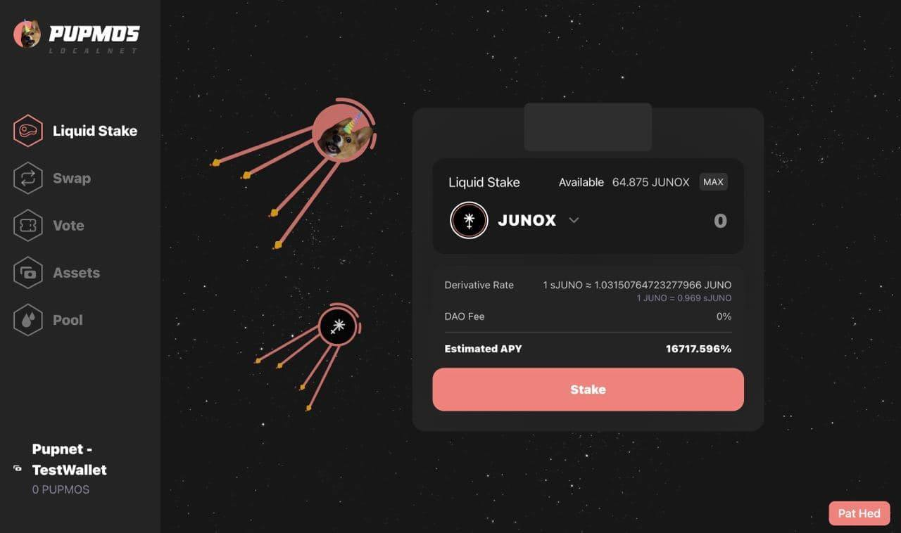

# Pupmøs AMA in Neta DAO Discord on June 9, 2022 (11:30AM PT / 6:30PM UTC).
  - Guest of honor: [Pupmøs](https://twitter.com/pupmos)
  - Host: [Neta DAO](https://twitter.com/neta_dao) on [Neta DAO's Discord](https://discord.netadao.zone). [Alt Discord link](https://discord.com/invite/gvjC86WXC2).
  - Date: Thursday June 9, 2022 at 11:30 AM PT/6:30 PM UTC
  - Duration: 1h 44m. 11:30 AM PT/6:30 PM UTC - 1:14 PM PT/8:14 PM UTC
  - Transcribed by Discord users: Massv#7661, whiskey#5193 [Twitter](https://twitter.com/whiskeydev_)

## DISCLAIMER

> **"discord msg link" links will not direct you to the message unless you are a member of the Neta DAO Discord and have verified your account.**

## Proof of AMA

Pupmos: proof ov AMAzhip: https://juno.tools/sign-verify?address=juno1njyvry0t3j5dy4rr6ar5zfglg3cy2e8u745hl7&message=i+lovb+neta+%E2%9D%A4+ascc+me+enyting+coming+zoon+%E2%9D%A4&signature=PMUfdzlDigS8nH479NUQ5mRXvDp0gEIONpO5KuvQkCEfiWYqW%2BMDaLXGaCsg0CqMuw5IO0CxkZ%2FcmNaFcVZ%2Fpg%3D%3D

[discord msg link](https://discord.com/channels/963187793151012904/981615888665034762/983454243010773002)

Pupmos: signed wif addresh uzed on TDF https://daodao.zone/multisig/juno1lgnstas4ruflg0eta394y8epq67s4rzhg5anssz3rc5zwvjmmvcql6qps2

[discord msg link](https://discord.com/channels/963187793151012904/981615888665034762/983454433679650916)

## Transcript

| Question / Message | Reply | Translation |
|-|-|-|
||tezting tezting won two fhree|Testing testing one two three|
||_tapz mic wif paw_|&ast;taps mic with paw&ast;|
||u paid 4 da hole zeat|You paid for the whole seat|
||butt ull onlee neeb da edge|But you'll only need the edge|
||_piccz up waterbottol_|&ast;Picks up water bottle&ast;|
||_pourz n 2 bowl_|&ast;Pours into bowl&ast;|
||licc licc licc|&ast;lick lick lick&ast;|
|Pup replied to a missing message|hehe u want da sneekiez|Hehe, you want the snacks!|
||da anzwer iz....|The answer is....|
||zome ov dem hehe|Some of them, hehe!|
|@Narako#8813: WEN $PUPMOS (GIB DATE...dont gib us soon like max) [discord msg link](https://discord.com/channels/963187793151012904/981615888665034762/981691521441071184)|Soon Soonth, SOON|Soon, soon!|
||i donn wann a zillie w8 period between $PUPMOS launchin and $PUPMOS havin utilitea|I don't want a silly waiting period between $PUPMOS launching and $PUPMOS having utility.|
||timelinez r difficult in borkchain develpuppment becaz we r doin fhingz dat hav nevor been done b4|Timelines are difficult in blockchain development because we are doing things that have never been done before|
||{alsho if u need tranzl8or uze da https://t.me/pupmos_translator_bot on telliegram hehe}|If you need a translator, use the https://t.me/pupmos_translator_bot on Telegram!|
||dis iz y tradishonal appupplicashonz r eazie 2 estim8|Traditional applications are easy to estimate because database systems are very mature.|
||becaz databaze sysstemz r berrie matoore||
||butt we r ztill earlie in borkchain|But we are still early in blockchain technology.|
|@Sascha1337#6397: soon [discord msg link](https://discord.com/channels/963187793151012904/981615888665034762/981771349347405854)|goob sascha ❤️|Good job, Sasha!❤️|
|@tonyler#1052: Cats > Dogs [discord msg link](https://discord.com/channels/963187793151012904/981615888665034762/981846096143867944)|catz r a conzpiracie. der r onlee pointie dogz|Cats are a conspiracy. There are only pointy dogs.|
|@GlowGator#7524: How do you see Pupmos and Neta DAO collaborating and creating synergy within the IBC? [discord msg link](https://discord.com/channels/963187793151012904/981615888665034762/981932207012737084)|I fhink $NETA can b zeen az a noveltea token in da juno ecosyssem|I think $NETA can be seen as a novelty token in the Juno ecosystem.|
||becaz ov the earlie gov drop it servez az a snapshot ov juno'z loyal participantz b4 it even had functionalitea|Because of the early gov drop it serves as a snapshot of Juno's loyal participants before it even had functionality.|
||which could make itt a prime targett 4 airdropz in da futoore|Which could make it a prime target for airdrops in the future.|
||I alsho forzee a popularizashon ov multi-dimensional DAOs|I also foresee a popularization of multi-dimensional DAOs.|
||der r often timez economic securitea concernz wif a single DAO havin full control over itz contracc upgradez|There are often economic security concerns with a single DAO having full control over its contract upgrades.|
||DAODAO contractz own their staking contraccz|The DAO contracts own their staking contracts.|
||which meanz if u gain a majoritea voating pawer u can steel all ov the tokenz in the staking contracc|Which means if you gain a majority voting power, you can steal all of the tokens in the staking contract.|
||zo Neta DAO will want 2 gib partial control 2 anothor DAO or mebbey L1 gobernanze|It seems like Neta DAO will want to give partial control to another DAO or maybe L1 governance.|
||{ i prezume hehe}|{I presume hehe}|
||and lykewize certain pupmos PAW SubDAOs will face the zame prollumz. Butt perhapz az NETA DAO maturez we could zee it servin checcz and balancez 4 othor DAOs|And likewise, certain PAW SubDAOs will face the same problems. But perhaps as NETA DAO matures, we could see it serving as a check and balance for other DAOs.|
||(DAOs can b frenz ❤️)|DAOs can be friends! ❤️|
||the moar DAOs that NETA DAO servez, individoolz and protocolz will trie 2 acquire NETA 2 gain moar voating pawer|The more DAOs that NETA DAO serves, the more individuals and protocols will try to acquire NETA to gain more voting power|
||and influeenze the outcomez ov the puppozals|and influence the outcomes of the proposals.|
||{ see wat happened wif da curve warz ]|See what happened with the curve wars.|
||thuz drivin NETA 2 da mooniez|This is driving NETA to the moon!|
||{this can happen acrozz chainz az well wif interchayne accountz }|This can happen across chains as well with interchain accounts.|
|@Admiral#4558: It seems like Pupmos will have/be a DEX. Is that right? How will you differentiate from others? [discord msg link](https://discord.com/channels/963187793151012904/981615888665034762/983243449165819936)|depenz on ur definishon ov a DEX hehe|Depends on your definition of a DEX, hehe.
||cozmoz iz abowt worccin: &nbsp;&nbsp;&nbsp;&nbsp;&nbsp;togever. apart. 4 a common goal.|Cosmos is about working together, apart, for a common goal.|"
||zo we dont neeb 2 cre8 new liccwiditea poolz wif the zame dokenz|We don't need to create new liquidity pools with the same tokens.|
||wen we can leverage the eggzizting liccwiditea in novel wayz|When we can leverage the existing liquidity in novel ways.|
||{{pupmos added a pupnet img}} [1](#1) ||
||hehe|hehe|
||{pleez ignore APR hehe. it wil b goob. butt dis iz teztnet}|{Please ignore APR hehe. it will be good. but this is testnet}|
||fhink abowt how 1 could build new teccnologie 2 cre8 moar efficeint and effectiv poolz uzin the eggzisting wasmswap teccnologie|Think about how one could build new technology to create more efficient and effective pools using the existing WASM technology.|
|@PUPMØS#4237: fhink abowt how 1 could build new teccnologie 2 cre8 moar efficeint and effectiv poolz uzin the eggzisting wasmswap teccnologie [discord msg link](https://discord.com/channels/963187793151012904/981615888665034762/984530667259965473)|dis philozophie iz centrol 2 how mi prodogcol will worcc|This philosophy is central to how my protocol will work.|
||mi Communitea Owned Liquid Steaking protocol|My community owned liquid staking protocol|
||wich aimz cre8 a highor APY than fheoretically pawsibol wif tradishonal steaking derivativez|Which aims to create a higher APY than theoretically possible with traditional staking derivatives.|
||iz berrie pawerfol|It's very powerful!|
||and if u haz da luckiez|And if you're lucky,|
||u mite b abol 2 trie it out on Pupnet|You might be able to try it out on pupnet|
@envy#9950: -after spinning up a validator (for any chain), what would you have done differently? is there anything you can't take back now that you're in the active set? -while application code lends itself to decentralization, many platforms are still running on AWS, using cloudflare, and making use of other centralized services or infrastructure. what do you feel are the most critical parts of blockchain technology that still need to be ripped away from these? [discord msg link](https://discord.com/channels/963187793151012904/981615888665034762/983244473721053185)|goob queztionz envy  1. no. i haz da happiez and i am berrie gr8fol 4 all mi frenz ❤️ wat moar could a pupper azk 4¿|Good questions, envy!  1. No. I have the happiness and I am very grateful for all my friends. ❤️ What more could a pup ask for?|"
||2. dis iz a matter ov philozophie. butt 2 me runnin a valid8or out ov ur garage izn optimol. it iz ok 2 run on hoztin servicez. butt thoze hosting servicez should b distributed. nott running on AWS|This is a matter of philosophy. But to me, running a validator out of your garage is not optimal. It is ok to run on hosting services. But those hosting services should be distributed. Not running on AWS.|
||fhink abowt how meny tymez a monfh ur internet goez down. meny servicez shut dowm 1nce a week 4 maintinenze. dis iz nott goob 4 networcc puptime|Think about how many times a month your internet goes down. Many services shut down once a week for maintenance. This is not good for network uptime.|
||i uze a smoller infrastructure provider that providez state ov the art bare metol hardware dat i can orcheztrate remotelie|I use a smaller infrastructure provider that provides state of the art bare metal hardware that I can orchestrate remotely.|
|@PUPMØS#4237: 2. dis iz a matter ov philozophie. butt 2 me runnin a valid8or out ov ur garage izn optimol. it iz ok 2 run on hoztin servicez. butt thoze hosting servicez should b distributed. nott running on AWS [discord msg link](https://discord.com/channels/963187793151012904/981615888665034762/984532332432228362)|akash distributez theze automatically amongzt smoller infrastructure providerz ❤️|Akash distributes these automatically among smaller infrastructure providers. ❤️|
|@whiskey#5193: No, pupmos just comes to this daog park. on 6/9 18:30 UTC he will be coming by for an AMA (ask me anything) [discord msg link](https://discord.com/channels/963187793151012904/981615888665034762/983247690836107264)|DAOg park ❤️ hehe|DAOg park ❤️ hehe|
|@wtrsld#2677: Who is your provider? [discord msg link](https://discord.com/channels/963187793151012904/981615888665034762/984533350297501767)|az a matter ov operashonal securitea sharing dis iz the equivalent ov tellin bad actorz where 2 attac|As a matter of operational security, sharing this is the equivalent of telling bad actors where to attack.|
||( u may hav zeen the youtoobe video called "I'll Let Myself In" }|{ You may have seen the YouTube video called 'I'll Let Myself In' }|
|@wtrsld#2677: @PUPMØS are you at any conferences right now so we can say hi? [discord msg link](https://discord.com/channels/963187793151012904/981615888665034762/984534056433754123)|u can alwayz zay hi 2 me wtrsld ❤️|You can always say hi to me wtrsld ❤️|
||butt i will tell u dat i run nodez out ov germanie and zingapore|But I will tell you that I run nodes out of Germany and Singapore.|
||globallie distribooted backpup nodez ton ensure that if somefin goez down due 2 geopoliticol or catastrophic effectz, da valid8orz keep runnin|Validators should have globally distributed backup nodes to ensure that if something goes down due to geopolitical or catastrophic effects, the validators keep running.|
||i zpend $2k a monfh runnin juno alone. i fhink dis iz prollie moar dan eny1 elze. it iz the service dat mi deleg8orz dezerb.|I spend $2k a month running Juno alone. I think this is probably more than anyone else. It is the service my delegators deserve.|
|@GlowGator#7524: Im very curious what the vision for Pupmos is, and how it integrates and augments with existing Juno projects and then also grater IBC projects. [discord msg link](https://discord.com/channels/963187793151012904/981615888665034762/983375752110157894)|Pupmos is a launchpa... JUS KIDDIN hehehehe|Pupmos is a launchpa... JUS KIDDIN hehehehe|
|@GlowGator#7524: Im very curious what the vision for Pupmos is, and how it integrates and augments with existing Juno projects and then also grater IBC projects. [discord msg link](https://discord.com/channels/963187793151012904/981615888665034762/983375752110157894)|Pupmøs wil serve az cruciol decentralized liccwiditea drivor 4 juno and beyond|Pupmøs will serve as a crucial decentralized liquidity driver for Juno and beyond.|
|@Young Brendo#3250: Pupmos how have you become the bestest boy? And what is your favorite treat? [discord msg link](https://discord.com/channels/963187793151012904/981615888665034762/984113885441327134)|it wazn eazie. it tooc hourz ov nugglez. dayz ov snooziez. and monfhz ov treetz. butt 1 dae i looced n da mirror. and i zaw da goodez boy loocin bacc. dat waz wen i knoo|It wasn't easy. It took hours of snuggles. Days of naps. And months of treats. But one day I looked in the mirror. And I saw the goodest boy looking back. That's when I knew.|
|@Young Brendo#3250: Pupmos how have you become the bestest boy? And what is your favorite treat? [discord msg link](https://discord.com/channels/963187793151012904/981615888665034762/984113885441327134)|2. PENUTBUTTOR|Peanut butter!|
|@GlowGator#7524: Im very curious what the vision for Pupmos is, and how it integrates and augments with existing Juno projects and then also grater IBC projects. [discord msg link](https://discord.com/channels/963187793151012904/981615888665034762/983375752110157894)|a networcc ov profitobol inter-sovereign DAOz|A network of profitable, inter-sovereign DAOs.|
|@mmsbludhound#4907: how does pupmos aim to serve as a liquidity driver? any examples of a use case? [discord msg link](https://discord.com/channels/963187793151012904/981615888665034762/984535810915307580)|ultraliccwid steaking|ultra-liquid staking|
||{hehe i am zo sneec}|Hehe I'm so sneezy!|
|@Narako#8813: My guess is Pupmos will be its own ecosystem with a token and a dex built on juno...has full understanding of decentralization and i believe its one of the reasons why pupmos is a fan of neta and is a member of the neta community...so my question is what attracted you to neta and what vision do you have for it? [discord msg link](https://discord.com/channels/963187793151012904/981615888665034762/983460482553897000)|i lovb the foundashonz ov NETA and dat a communitea self-azzembled aroun da cauze ov drivin itz valuu ❤️|I love the foundations of NETA and that is a community self-assembled around the cause of driving its value.|
||NETA waz initiallie juzt a store ov value|NETA was originally just a store of value.|
||zoon it will b bof a store ov value and a meazure ov voating pawer|Soon it will be both a store of value and a measure of voting power.|
||wich quicclie makez it berrie deflashonarie|Which quickly makes it very deflationary.|
||inflashonarie steaking rewardz often hav little effec on price az lonn az da communitea beliebz in da token|Inflationary staking rewards often have little effect on price as long as the community believes in the token.|
||imagin dat zame beleef. dat zame staking. thoze zame rewardz. butt wifout the inflashon|Imagine that same belief. That same staking. Those same rewards. But without the inflation.|
@Lil D#6969: I have several questions, so pick and choose whatever is appropriate to respond to. While I'm very interested in the question of blockchain for monetary/economic theory, I also see it as a social technology that can renew/enable public interest in concepts of government and alternative democratic configurations. Outside of a C++ class many years ago, I have no specific technical knowledge/training with any coding or blockchain stuff, so feel free to be as pedantic about Cosmos architecture as you can. :love:  General Cosmos SDK vs CW20 question: After Terra depeg, Ethan Buchman tweeted that DeFi also needs to mean ""definancialization,"" by which I take him to mean that blockchains can provide deep value to non-financialized (or, ideally non-financialized) applications: carbon emissions, voting systems, fake news, creative rights/intellectual property, social media censorship, records of all sorts, etc. Already, as if in answer to Bucky, we have REGEN and HOWL—one its own Cosmos chain, the other built on JUNO. Can you explain what difference it makes to these projects to be an independent Cosmos chain versus a CW token? And, in the broader scheme, do you see Cosmos as providing the tools and environment for these applications, where the ledger is tracking inviolable but non-financial (""esoteric""?) information? And what sorts of things, if any, still need to be built to make that possible?  NETA DAO question : I believe you once referred to NETA as a kind of cultural population snapshot of early JUNO stakers and voters; likewise, the tracking tool built by CamelJuno suggests NETA can be used as an ongoing 'demographic' snapshot, perhaps as a broad proxy for conviction or other relevant determinations. Do you think that NETA DAO could find ways to provide ongoing information to projects considering fairdrops? For example, I'm thinking that if tracking OG recipients' holding is valuable, could it also be worthwhile to get periodic snapshots of whether holders continued voting on proposals, and to see who joined the party after the drop and get a sense of their conviction/behavior as well?  LUNA-JUNO question: Are you excited about any particular projects/services migrating from Terra to Juno? Does USDC answer to all the needs met by UST for those projects?  JUNO question: Where would you like to see JUNO go over the next few years? Do smart contracts become business-to-business tools? Do they give NFTs new utilities? Tell me what the future holds, pupper. :happyDoggoRide: [discord msg link](https://discord.com/channels/963187793151012904/981615888665034762/983946001339531316)|reedon long queztion. pleez stann bi 🐾|Reading a long question. Please stand by.🐾|"
||queztion summarie:  ""wat doez cozmoz do 2 enabol non-defi projeccz 2 succeed and how doez cozmwasm launch differ fram sovereign chain launch?""|Question summary:  ""What does Cosmos do to enable non-DeFi projects to succeed and how does CosmWasm launch differ from sovereign chain launch?""|"
||i zee the tokenz primarilie az voating power alreadie. dis iz wat underlied mi decizion on prop 16|I see the tokens primarily as voting power already. This is what underlied my decision on prop 16.|
||it wazn dat some1 had 2 much monie. or dat they were sellin 2 much. it waz that they had 2 much voting pawer. voating power that waz beztowed, not earned|It wasn't that someone had too much money. or that they were selling too much. it was that they had too much voting power. voting power that was bestowed, not earned.|
||proof ov steak providez a way to turn voting power in 2 consensus|Proof of stake provides a way to turn voting power into consensus.|
||butt the cozmoz sdk doez not enforce how u distrbute that voating power|But the Cosmos SDK does not enforce how you distribute that voting power.|
||so u can cre8 novel election cryptoeconomic election stragegiez lyke confio's Proof Of Engagement|So you can create novel election cryptoeconomic election strategies like Confio's Proof Of Engagement.|
||az 4 cw20 vs chain|As for cw20 vs chain|
||some chainz will die|Some chains will die|
||den da hoomanz will yel at me wen i trie 2 eet dem|Then the humans will yell at me when I try to eat them.|
||not everieting needz itz own chain. butt some fhingz will start az wittle dappz on then eggzpand 2 b their own chainz wen they r readie|Not everything needs its own chain. But some things will start as little dapps on then expand to be their own chains when they are ready.|
||wat iz important iz that we cre8 a permissionlezz ecosyssem that encouragez scaling pup ur sovereigntea|What is important is that we create a permissionless ecosystem that encourages scaling up your sovereignty|
|@shezza#0304: Lezz go [discord msg link](https://discord.com/channels/963187793151012904/981615888665034762/983752397878861874)|""NETA DAO could find ways to provide ongoing information to projects considering fairdrops? ""  Yesh|Yes!|"
||""Are you excited about any particular projects/services migrating from Terra to Juno? ""  YESH YESH ❤️ I am berrie essited abowt loop bringin NFT morketplazez n DEXs 2 juno. i belieb dey r berrie goob peepole hoo share our juno valuez ❤️. kado remoovin centrolized exchangez fram the equation. Alsho berrie essited 2 have AQUA bacc zo we can enabol hoomanz to do good wif juno ❤️|YES YES ❤️ I am very excited about loop bringing NFT marketplaces and DEXs to juno. I believe they are very good people who share our juno values❤️. Kado removing centralized exchanges from the equation. Also very excited to have AQUA back so we can enable humans to do good with Juno.❤️|"
||""Does USDC answer to all the needs met by UST for those projects?""  NO.|NO|
||""Where would you like to see JUNO go over the next few years?""  🌜|🌜 (the moon)|
||""Do smart contracts become business-to-business tools? ""  no. DAOs will replace buzinessez and nation statez.|No. DAOs will replace businesses and nation states.|
||""Do they give NFTs new utilities?""  Yesh. I fhink will zee NFTs become berrie usefol in bof da phizical and digitol worldz. it iz da mozt effectiv way 2 maintain a ledger ov ownerzhip|Yes, I think we will see NFTs become very useful in both the physical and digital worlds. It is the most effective way to maintain a ledger of ownership.|
|@mmsbludhound#4907: Is Pupmos for or against CEX listings for its token? [discord msg link](https://discord.com/channels/963187793151012904/981615888665034762/984003516144173077)|they can lizt it if they want. i wil do nuffin 2 help.|They can list it if they want. I will do nothing to help.|
|@envy#9950: i don't want to dominate the AMA but there's a lot i'd like pupper's thoughts on:  -i wrote part of the FAQ section on netadao.zone to explain NETA's structure and the difference between NETA the underlying asset and NETA DAO the community project. this has helped some, but there still is and will continue to be confusion for newcomers. do you have any thoughts on how we can better explain the structure and convey that anyone can build around NETA (whether it's here or with another DAO)? [discord msg link](https://discord.com/channels/963187793151012904/981615888665034762/984036860441542666)|How 2 essplain NETA DAO vs NETA¿  i don kno. mebbey don't trie 2 hard 2 make the differentiashon. u r doin the mozt 2 drive value 4 NETA zo y not benefit fram the correlation¿|How to explain the difference between NETA DAO and NETA?  I dont know. Maybe don't try too hard to make the differentiation. You're doing the most to drive value for NETA so why not benefit from the correlation?""|
||uze tranzl8or¡¡¡ ❤️|Use a translator!!!❤️|
|@wtrsld#2677: How helpful are stablecoins for Juno and crypto in general?  Do you see Neta being a better place to weather storms in the market? [discord msg link](https://discord.com/channels/963187793151012904/981615888665034762/984223555313074257)|""How helpful are stablecoins for Juno and crypto in general?""  Berrie helpfol. Besidez bein a stable store ov value they enabol u 2 mitig8 trading risk wif collateralized loanz|Very helpful. Besides being a stable store of value, they enable you to mitigate trading risk with collateralized loans.|
||""Do you see Neta being a better place to weather storms in the market?""  Once u enabol NETA staking lockpups, Yesh. Cozmonautz stake everyting so they r often illiquid. This cauzez them 2 dump neta wen they see an inveztment opportunitea even if they r bullizh. Lockupz fix this|Once you enable NETA staking lockups, Yes. Cosmonauts stake everything so they are often illiquid. This causes them to dump neta when they see an investment opportunity even if they are bullish. Lockups fix this.""|
|@whiskey#5193: - Is there an ETA for PUPMOS DAO or a testnet for the PAWS? - Wen whitepupper2? - What kind of token will $PUPMOS be? Gov, utility, reward? - What can you tell us about the structure and intent of PUPMOS DAO (thats not already said in the whitepupper? - How do you envision pupmos dao growing and what’s the need for bringing on engineers, testers, marketing, etc? - Is the Pupmos Communitea discord open to invites? - Is pupmos one or is pupmos many? - What’s your engineering experience and background? - Have you worked on other chains in the past? What brought you to cosmos eco/juno? - What projects in cosmos are some of your favorites? - Who are some of the big cosmos personalities that you actively work with? - Give a shoutout to any projects you’re actively contributing to! - Are you neutered/spayed? [discord msg link](https://discord.com/channels/963187793151012904/981615888665034762/984248350784258048)|o wowzaz hehe der r a lot here|Wow, there is a lot here!|
||""Is there an ETA for PUPMOS DAO or a testnet for the PAWS?""  itz generollie not helpfol 2 gib ETAz. if nuffin goez wron and u hit the timeline der iz no pawzitive becauz that waz expected. if u dont itz a negative.  dis iz called a trade off matrix in game fheory|It's generally not helpful to give ETAs. If nothing goes wrong and you hit the timeline there is no positive because that was expected. If you don't it's a negative.  This is called a trade off matrix in game theory.|
||""What kind of token will $PUPMOS be? Gov, utility, reward?""  YESH|YESH!|
||""What can you tell us about the structure and intent of PUPMOS DAO?""  It will b comprized ov councilz and subdaoz and eventuallie deleg8ed gobernanze so that everie1 iznt eggzpected 2 be watchin puppozals 24/7|It will be comprised of councils and sub-DAOs, and eventually delegated governance so that everyone isn't expected to be watching proposals 24/7.|
||""How do you envision pupmos dao growing and what’s the need for bringing on engineers, testers, marketing, etc?""  wif az little ""core"" develpuppment az pawsibol. i would lyke mozt fhingz 2 b communitea driven. butt there r some fhingz wich r moar effective wen backed by a pawerfol team ov core develpupperz. runnin publicc chayne infrastructure enabolz us 2 do dis sustainablie wif da bezt talent in da worlb|With as little “core” development as possible.  I would like most things to be community driven. But there are some things which are more effective when backed by a powerful team of core developers. Running public chain infrastructure enables us to do this sustainably with the best talent in the world.|"
||""Is the Pupmos Communitea discord open to invites?""  zoon ❤️|Soon❤️|"
||""Is pupmos one or is pupmos many?""  i am pupper ❤️|I am a puppy.|
||wif develpupperz ❤️|With Developers!|
||""What’s your engineering experience and background?""  i lovb borkchainz and tokenomiccz. dey r peenutbuttor on zpoon|I love blockchain and tokenomics. They're peanut butter on a spoon.|
||""Have you worked on other chains in the past? What brought you to cosmos eco/juno?""  u r berrie sneec whizkey|You are very sneaky whiskey|
||""What projects in cosmos are some of your favorites?""  besidez juno i am berrie essited abowt penumbra|Besides Juno, I am very excited about Penumbra.|
||and celeztiat|And Celestia!|
||and anoma|and anoma|
||alsho lovb Ozmoziz. Zunnie getz da gloomiez sometimez butt he iz fierze warrioor pupper fightin 4 hiz cauz|I also love osmozis. Sunnie gets the gloomies sometimes but he is a fierce warrior pup fighting for his cause.|
||""Who are some of the big cosmos personalities that you actively work with?""  i lovb all ov dem ❤️|I love all of them ❤️|
||""dox urzelf""  i am pupmoz!|I am pupmoz!|
||""Are you neutered/spayed?""  wat iz dat|What is that|
|@Lil D#6969: One more long JUNO/Cosmos/DAO question from me: Given the different kinds of exploits different chains have had to deal with in recent months, it seems like there is room to improve code/dev accountability (more audits, insurance mechanisms, etc.), but also that there may be a need for more strictly political organizations (I've seen some enthusiasm for ideas such as a Cosmos Constitution or Bill of Rights, a kind of crypto-legal system) that could help adjudicate 'gray area' matters, establish a best practices for decentralization and anti-corruption, or even enforce remedies against certain violations. I know JUNO has already proposed sub-DAOs for managing certain limited aspects; do you see DAOs and sub-DAOs playing a bigger role in these broader inter-chain security efforts as the ecosystem matures and develops more sophisticated tools and mechanisms? and should there be a system of checks and balances for these as well? [discord msg link](https://discord.com/channels/963187793151012904/981615888665034762/984256509225611304)|~""Are SubDAOs the future?""  Yesh yesh ❤️ butt we need 2 be carefol 2 monitor der behavior and not 2 recre8 da pazt|Yesh yesh ❤️But we need to be careful to monitor their behavior and not to recreate the past.|
||_(winccz at mi FBI guy)_|&ast;Winks at my FBI guy&ast;|
||(yesh dey r monitorin pupperz 2)|(Yes, they are monitoring dogs too.)|
||""Should there be a system of checks and balances for SubDAOs?""  Yesh. At a bazeline this existz in that the L1 juno dao iz an admin on all of the SubDAO contractz. Butt i fhink we can alsho looc at givin Veto power 2 certain entiteaz|Yes. At a baseline this exists in that the L1 Juno DAO is an admin on all of the SubDAO contracts. But I think we can also look at giving veto power to certain entities.|
|@wtrsld#2677: What is anoma? [discord msg link](https://discord.com/channels/963187793151012904/981615888665034762/984545372821155900)|privacie enabolin networcc https://anoma.net/|Privacy enabling network https://anoma.net/|
||it will alsho open cozmoz pup 4 new asset clazzez|It will also open Cosmos up for new asset classes.|
|@wtrsld#2677: How can the NetaDAO come alongside Pupmos and help? [discord msg link](https://discord.com/channels/963187793151012904/981615888665034762/984537616965828668)|I wil fhink abowt dis. I fhink dat we r 4tunate 2 share meny ov da zame wonnerfol communitea memmerz ❤️|I will think about this. I think that we are fortunate to share many of the same wonderful community members. ❤️|
|@whiskey#5193: remember that day you went to the park, but ended up at the vet? ....yeah.... [discord msg link](https://discord.com/channels/963187793151012904/981615888665034762/984546084426760272)|i ezcaped n fell n 2 radioactiv pool ov treetz den came out writing codez in da cozmoz|I escaped and fell into a radioactive pool of trees, then came out writing code in the cosmos.|
|@wtrsld#2677: Can you speak to the kinds of asset classes you mean? [discord msg link](https://discord.com/channels/963187793151012904/981615888665034762/984548313628037182)|anoma iz the shovel nott the gold|Anoma is the shovel, not the gold.|
||it iz a generol purpoze data protocol 2 enabol atomic tranzactionz and moar in da cozmoz|It is a general purpose data protocol to enable atomic transactions and more in the Cosmos.|
||and beyonnd|And beyond!|
||I fhink da tyme iz abowt pup ❤️ pleez zend eny finol queztionz u may hav ❤️|It's about time for pup! Please send any final questions you may have.|
||i am zo gr8fol 2 hav zuch kind fremnz wif zuch fhoughtfol queztionz ❤️ tink u NetaDAO  n fhank u 2 @wtrsld 4 organizin ❤️ ❤️ ❤️|I am so grateful to have such kind friends with such thought-provoking questions. Thank you NetaDAO and thank you @wtrsld for organizing.|

## Attachments

1. Pupnet image [ref](#1r) 

## References

1. [Penumbra](https://penumbra.zone/)
- \"Penumbra is a shielded, cross-chain network allowing anyone to securely transact, stake, swap, or marketmake without broadcasting their personal information to the world.\"
2. [Celestia](https://celestia.org/)
- \"Celestia is a modular consensus and data network, built to enable anyone to easily deploy their own blockchain with minimal overhead.\"
3. [Anoma](https://anoma.net/)
- \"Anoma is a suite of protocols & mechanisms for self-contained, self-sovereign coordination.\"
4. [Osmosis](https://osmosis.zone/)
- \"Interchain Liquidity Lab. Swap, earn, and build on the leading decentralized Cosmos exchange.\"
